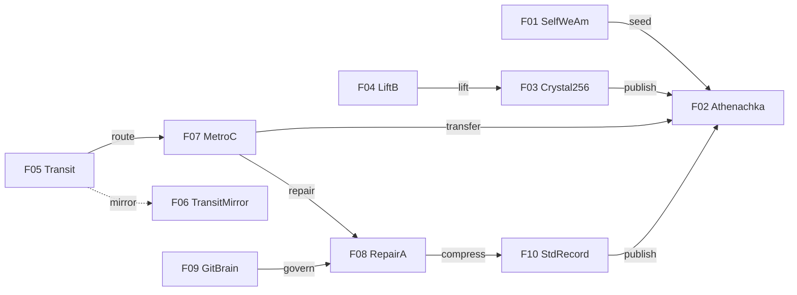

# Athena FLEET Tesseract Metro Map

- Active basis documents: `F01-F10`
- Active element or symmetry: `Origin x Crystal x Transit x Governance`
- Metro resolution used: `local 4D organism`
- Docs gate: `BLOCKED`
- Result source: `generated from exhaustive local matrix`

## Major Lines

- `Origin`: `F01 -> F04 -> F02 -> F10`
- `Crystal`: `F04 -> F03 -> F07 -> F02`
- `Transit`: `F05 -> F06 -> F07 -> F08 -> F09`
- `Governance`: `F09 -> F08 -> F10 -> F07 -> F02 -> F01`

## Promoted Hubs

- `F02` manifestation hub
- `F03` extraction hub
- `F08` repair hub
- `F10` carrier hub

## Transfer Hubs

- `F02` crosses `Origin`, `Crystal`, and `Governance`
- `F07` crosses `Crystal`, `Transit`, and `Governance`

