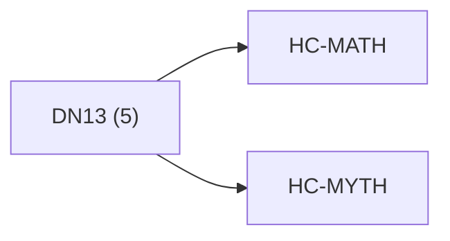

# Anchor Atlas: DN13

Docs gate: `BLOCKED`

## Crosswalk



## Family Mix

| Family | Records |
| --- | --- |
| identity-and-instruction | 2 |
| manuscript-architecture | 2 |
| transport-and-runtime | 1 |

## Top Records

| Record | Title | Primary | Family |
| --- | --- | --- | --- |
| f9508cd885957957c35753e8 | Truth lattice:[\mathbb T={\mathrm{OK},\ma... | MATH | transport-and-runtime |
| 87a317c561efb26cb804cf26 | VOYNICH EVA CLEAN | MYTH | identity-and-instruction |
| 375122b42dc57fc473fcd7ed | "ATHENA_OS" | MATH | manuscript-architecture |
| 0f1ef220f23f4c6e287587e0 | Athena OS | MYTH | identity-and-instruction |
| 066b07864edbe7f37140a6c1 | # METRO LINES | MATH | manuscript-architecture |

## Commands

```powershell
python -m self_actualize.runtime.query_myth_math_hemisphere_brain record --record-id <record_id>
python -m self_actualize.runtime.compose_myth_math_hemisphere_routes record --record-id <record_id>
python -m self_actualize.runtime.synthesize_myth_math_hemisphere_routes record --record-id <record_id>
```
