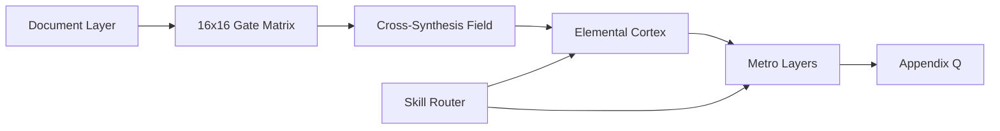

# Level 3 Metro Map - Deeper Neural Map

```mermaid
flowchart LR
D["Document Layer"] --> G["16x16 Gate Matrix"] --> X["Cross-Synthesis Field"] --> E["Elemental Cortex"] --> M["Metro Layers"] --> Q["Appendix Q"]
Skill["Skill Router"] --> E
Skill --> M
```
