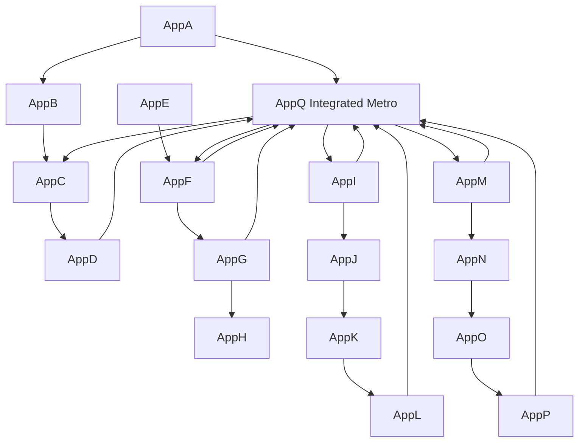

# Appendix Q - Integrated Appendix-Only Metro Map

Appendix Q is the appendix nervous system seen as one crystal instead of sixteen supplements.

```mermaid
flowchart TB
Q["AppQ Integrated Metro"]
A["AppA"] --> B["AppB"] --> C["AppC"] --> D["AppD"]
E["AppE"] --> F["AppF"] --> G["AppG"] --> H["AppH"]
I["AppI"] --> J["AppJ"] --> K["AppK"] --> L["AppL"]
M["AppM"] --> N["AppN"] --> O["AppO"] --> P["AppP"]
A --> Q
D --> Q
F --> Q
G --> Q
I --> Q
L --> Q
M --> Q
P --> Q
Q --> C
Q --> F
Q --> I
Q --> M
```
