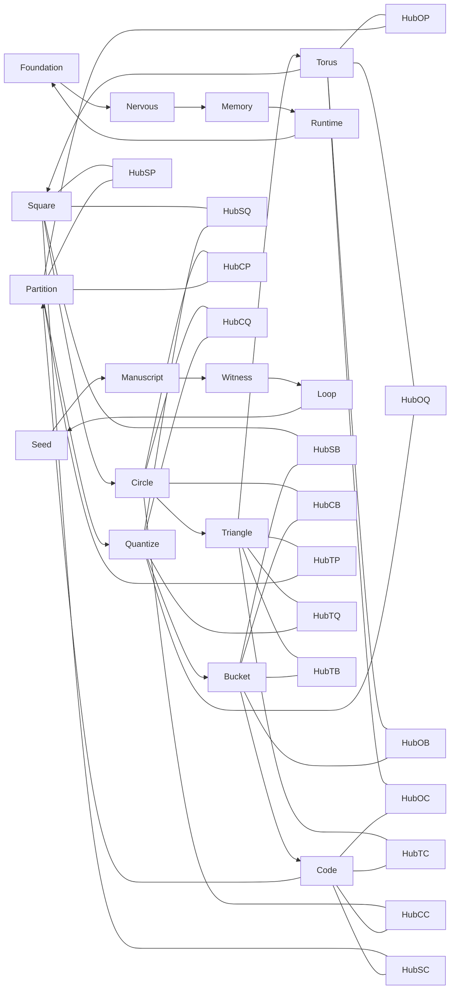

# System Metro Map

## Reading rule

- the geometry ring orders how cells move
- the operator ring orders what cells do
- the body ring orders where corpus pressure enters
- the closure ring orders how cells breathe
